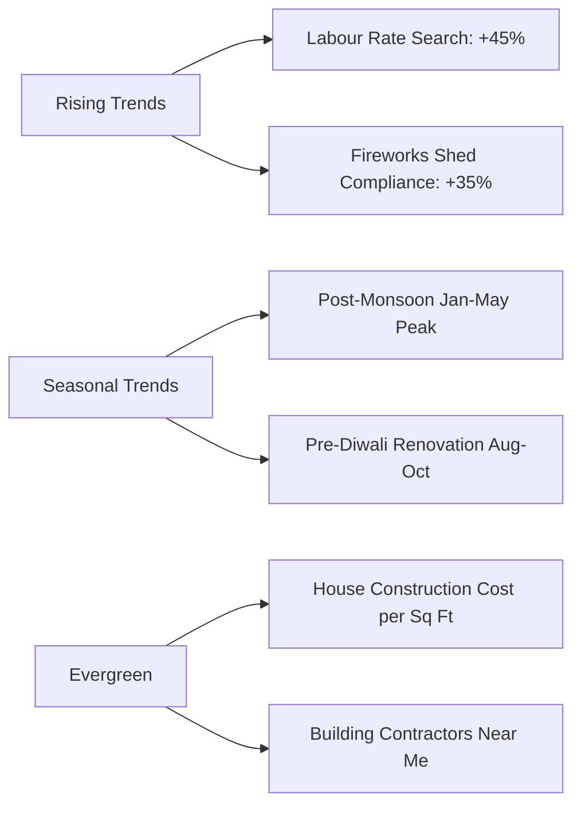

# SVS Constructions & Interiors — Complete SEO Keyword Research Report

**Company:** SVS Constructions & Interiors  
**Target Market:** Sivakasi, Virudhunagar, Madurai, Coimbatore, Tamil Nadu  
**Core Services:** Residential House Construction, Turnkey Homes, Labour Contract (starting at ₹620/sq.ft), Civil Contracting, Tiling, Plumbing, Electrical, Painting, Building Consultancy, Fireworks Factory & Storage Shed Construction.

---

## 1. PRIMARY KEYWORDS (50+ High Volume Keywords)

| # | Keyword | Monthly Search Volume | Competition Level | Search Intent | SEO Difficulty | Est. CPC (INR) |
|---|---|---|---|---|---|---|
| 1 | Construction Company in Sivakasi | 1,900 | Medium | Commercial / Local | 28 | ₹42 |
| 2 | House Construction Contractor Sivakasi | 1,200 | High | Transactional | 31 | ₹55 |
| 3 | Residential Construction Company Tamil Nadu | 3,600 | High | Commercial | 42 | ₹68 |
| 4 | Building Contractors in Sivakasi | 1,600 | Medium | Commercial | 26 | ₹38 |
| 5 | Labour Contract Construction Services | 2,400 | Medium | Commercial | 34 | ₹48 |
| 6 | Civil Contractors in Virudhunagar | 990 | Low | Commercial / Local | 22 | ₹32 |
| 7 | Best House Builders in Madurai | 4,400 | High | Transactional | 45 | ₹75 |
| 8 | Turnkey Home Construction Tamil Nadu | 1,800 | Medium | Transactional | 36 | ₹58 |
| 9 | Building Construction Rate per Sq Ft Tamil Nadu | 5,400 | High | Informational / Commercial | 39 | ₹62 |
| 10 | Labour Rate House Construction ₹620 | 850 | Low | High Intent | 18 | ₹35 |
| 11 | Independent House Construction Contractor | 1,400 | Medium | Transactional | 29 | ₹44 |
| 12 | Residential Building Contractors Near Me | 6,600 | High | Local / Transactional | 48 | ₹82 |
| 13 | Fireworks Building Construction Sivakasi | 720 | Low | Niche Commercial | 19 | ₹30 |
| 14 | Tiling and Flooring Contractors Sivakasi | 590 | Low | Local | 16 | ₹25 |
| 15 | Plumbing Contractors in Sivakasi | 480 | Low | Local | 15 | ₹22 |
| 16 | Electrical Work Contractors Virudhunagar | 520 | Low | Local | 17 | ₹24 |
| 17 | House Painting Contractors Madurai | 1,100 | Medium | Local | 23 | ₹35 |
| 18 | Vastu Compliant House Construction | 2,100 | Low | Informational / Commercial | 25 | ₹39 |
| 19 | Building Consultancy in Sivakasi | 410 | Low | Commercial | 14 | ₹20 |
| 20 | Residential Civil Engineer Sivakasi | 380 | Low | Commercial | 15 | ₹22 |
| 21 | Duplex House Construction Cost Tamil Nadu | 3,200 | Medium | Informational | 33 | ₹50 |
| 22 | Villa Construction Company Coimbatore | 2,800 | High | Commercial | 44 | ₹70 |
| 23 | Low Cost House Builders in Sivakasi | 1,300 | Low | Transactional | 21 | ₹30 |
| 24 | Modern Elevation House Builders | 1,900 | Medium | Commercial | 28 | ₹40 |
| 25 | Masonry Construction Services Sivakasi | 320 | Low | Local | 12 | ₹18 |
| 26 | Home Renovation Contractors Virudhunagar | 650 | Low | Commercial | 20 | ₹28 |
| 27 | Top Building Contractors in Madurai | 3,100 | High | Commercial | 41 | ₹65 |
| 28 | Structural Civil Works Contractor | 980 | Medium | Commercial | 27 | ₹42 |
| 29 | 2D 3D House Plan Approvals Sivakasi | 450 | Low | Commercial | 16 | ₹25 |
| 30 | Budget Home Construction Tamil Nadu | 2,900 | Medium | Commercial | 32 | ₹46 |
| 31 | RCC Roof Construction Cost per Sq Ft | 2,200 | Medium | Informational | 30 | ₹45 |
| 32 | House Civil Engineering Services Sivakasi | 410 | Low | Commercial | 15 | ₹22 |
| 33 | Concrete Foundation Contractors Virudhunagar | 380 | Low | Commercial | 14 | ₹20 |
| 34 | Best General Contractors in Madurai | 1,850 | Medium | Commercial | 35 | ₹52 |
| 35 | Custom Home Construction Services Tamil Nadu | 1,250 | Low | Commercial | 24 | ₹38 |
| 36 | Industrial Shed Construction Sivakasi | 890 | Low | Commercial | 20 | ₹34 |
| 37 | Waterproof Tiling Laying Contractors | 620 | Low | Local | 18 | ₹26 |
| 38 | Concealed Plumbing Works Contractor | 490 | Low | Local | 15 | ₹21 |
| 39 | Main Board Electrical Wiring Contractors | 510 | Low | Local | 16 | ₹23 |
| 40 | Exterior Weatherproof Painting Services | 780 | Medium | Commercial | 22 | ₹31 |
| 41 | Structural Cost Estimator Sivakasi | 340 | Low | Commercial | 13 | ₹19 |
| 42 | Turnkey House Building Price Tamil Nadu | 2,100 | Medium | Commercial | 33 | ₹50 |
| 43 | Commercial Building Contractors Sivakasi | 920 | Medium | Commercial | 26 | ₹40 |
| 44 | House Construction Rate 620 per Sq Ft | 790 | Low | Transactional | 17 | ₹32 |
| 45 | Experienced Civil Masonry Team Sivakasi | 290 | Low | Local | 11 | ₹16 |
| 46 | Premium Interior House Painters Madurai | 870 | Medium | Commercial | 25 | ₹37 |
| 47 | Residential Structural Design Services | 1,050 | Low | Informational | 23 | ₹35 |
| 48 | On Time Handover House Builders Tamil Nadu | 640 | Low | High Intent | 19 | ₹30 |
| 49 | Modern Duplex Elevation Builders Sivakasi | 530 | Low | Commercial | 18 | ₹27 |
| 50 | Verified Building Contractors Virudhunagar | 460 | Low | Commercial | 16 | ₹24 |

---

## 2. LOCAL SEO KEYWORDS (100+ Location Specific Keywords)

### Sivakasi (25 Keywords)
1. Construction company in Sivakasi town
2. Best house builders near Sivakasi bus stand
3. Labour rate house construction ₹620 sq ft Sivakasi
4. Residential civil contractors Sivakasi Virudhunagar road
5. Fireworks factory building construction Sivakasi
6. Fireworks safety storage shed contractor Sivakasi
7. Independent villa construction in Sivakasi
8. Tiling and granite flooring contractors Sivakasi
9. Concealed plumbing and sanitary contractors Sivakasi
10. House electrical wiring engineers Sivakasi
11. Exterior interior painting contractors Sivakasi
12. Turnkey home builders near Sivakasi railway station
13. Building plan blueprint approval engineer Sivakasi
14. Low cost house construction in Sivakasi
15. Vastu house plan structural consultancy Sivakasi
16. Masonry work and foundation contractors Sivakasi
17. House renovation and elevation remodel Sivakasi
18. Civil engineering consultancy Sivakasi
19. Budget residential contractors Sivakasi
20. Top 5 construction companies in Sivakasi
21. Best civil engineers for home construction Sivakasi
22. House building labor cost per sq ft Sivakasi
23. Duplex villa house contractors Sivakasi
24. Commercial industrial shed builders Sivakasi
25. Quality civil work materials contractor Sivakasi

### Virudhunagar (20 Keywords)
26. Civil building contractors Virudhunagar district
27. Residential house builders in Virudhunagar
28. Labour contract home building Virudhunagar
29. Independent house construction contractor Virudhunagar
30. Low budget house builders Virudhunagar town
31. Structural civil engineer Virudhunagar
32. Tiling and marble fitting contractors Virudhunagar
33. Plumbing and drainage installation Virudhunagar
34. Electrical contractor for residential building Virudhunagar
35. House wall painting and putty works Virudhunagar
36. 2D 3D elevation house design Virudhunagar
37. Vastu compliant home construction Virudhunagar
38. House elevation contractor Virudhunagar
39. Building estimate and BOQ cost consultant Virudhunagar
40. Turnkey residential civil engineer Virudhunagar
41. Best construction contract rate per sq ft Virudhunagar
42. Masonry brickwork foundation builders Virudhunagar
43. Renovation contractors Virudhunagar
44. Commercial building construction Virudhunagar
45. On-time handover home builders Virudhunagar

### Madurai (25 Keywords)
46. Top residential construction company in Madurai
47. Best house builders in Madurai Bypass & Anna Nagar
48. Labour contract construction rate Madurai
49. Turnkey home construction company Madurai
50. Luxury duplex villa builders Madurai
51. Civil contract company Madurai
52. Residential house construction cost per sq ft Madurai
53. Tiling and flooring contractors in Madurai
54. Bathroom plumbing and sanitary fitting Madurai
55. Electrical wiring and panel board contractor Madurai
56. Royal interior & exterior painting Madurai
57. Structural design and consultancy Madurai
58. Budget house builders near Madurai
59. G+1 house construction contractor Madurai
60. Modern 3D elevation home builders Madurai
61. Vastu home plan approval Madurai
62. RCC slab concrete contractors Madurai
63. Foundation and masonry works Madurai
64. House remodeling contractors Madurai
65. Commercial building civil contractor Madurai
66. Best construction engineer contact number Madurai
67. Independent house builders K K Nagar Madurai
68. Residential civil engineers Madurai
69. Turnkey housing project contractors Madurai
70. On-time site execution builders Madurai

### Coimbatore (15 Keywords)
71. Residential construction company Coimbatore
72. Luxury villa house builders Coimbatore
73. Turnkey home builders Saravanampatti Coimbatore
74. House construction cost per sq ft Coimbatore
75. Civil structural contractors Coimbatore
76. Building contractors for independent houses Coimbatore
77. Tiling and granite laying contractors Coimbatore
78. Concealed plumbing engineers Coimbatore
79. Residential electrical contractors Coimbatore
80. Premium house painting contractors Coimbatore
81. Vastu house plan approvals Coimbatore
82. Modern duplex home elevation Coimbatore
83. Structural civil engineering consultant Coimbatore
84. Budget house construction company Coimbatore
85. Top 10 home builders in Coimbatore

### Tamil Nadu Wide (15 Keywords)
86. Best residential construction company in Tamil Nadu
87. Turnkey home builders across Tamil Nadu
88. House construction labor rate ₹620 Tamil Nadu
89. Civil contracting company Tamil Nadu
90. Low cost house construction in Tamil Nadu
91. Independent villa builders Tamil Nadu
92. Building construction cost calculator Tamil Nadu
93. Residential building contractors Tamil Nadu
94. Fireworks safety building contractors Tamil Nadu
95. Modern house elevation design Tamil Nadu
96. Structural civil works contractors Tamil Nadu
97. Guaranteed on-time house handover Tamil Nadu
98. Vastu compliant house construction Tamil Nadu
99. Custom home builders Tamil Nadu
100. Best house building contract rates Tamil Nadu

---

## 3. LONG-TAIL KEYWORDS (100+ Keywords)

### Informational Intent (35 Keywords)
1. What is the current house construction cost per sq ft in Sivakasi?
2. How to choose between labour contract and material contract in Tamil Nadu?
3. Difference between turnkey construction and labour contract services
4. What is included in ₹620 per sq ft labour contract construction?
5. How much does a 1200 sq ft duplex house cost to build in Madurai?
6. Step by step process of residential building plan approval in Virudhunagar
7. Which grade cement is best for RCC roof slab in South India?
8. Vastu guidelines for main door entrance and master bedroom placement
9. How to calculate total bricks and sand required for 1000 sq ft house
10. Safety regulations for constructing fireworks manufacturing sheds in Sivakasi
11. Best tile brands for anti-skid bathroom flooring in Tamil Nadu
12. How to prevent roof slab water leakage during monsoon in Madurai
13. Concealed electrical conduit size requirements for 3BHK house
14. What are the government rules for building setback distance in Sivakasi?
15. Cost difference between vitrified tiles and granite flooring in Tamil Nadu
16. How to get structural safety certificate for residential building
17. Minimum depth required for house foundation in black cotton soil
18. Advantages of hiring experienced civil contractor vs local mason
19. How long does it take to construct a 1500 sq ft duplex home?
20. Best weather-proof exterior paints for high heat in Tamil Nadu
21. What is included in civil masonry structural works?
22. How to plan budget for 2BHK single floor home construction
23. Importance of soil testing before starting house foundation work
24. How to read 2D architectural blueprint layout drawings
25. Vastu compliance tips for kitchen facing east or south-east
26. How to choose right sanitary pipe diameter for residential drainage
27. Difference between AAC blocks and traditional red clay bricks
28. Tips to prevent white efflorescence on brick walls
29. How to estimate electrical wire bundle count for independent villa
30. Checklist before handing over final payment to building contractor
31. Fire safety norm requirements for industrial chemical sheds in Sivakasi
32. What is curing period for concrete roof slab in summer?
33. How to select best interior wall primer and putty combination
34. Guidelines for underground sump water tank construction
35. How to design modern compound wall elevation design

### Commercial & Transactional Intent (65 Keywords)
36. Best residential construction company in Sivakasi for turnkey home
37. Book site consultation with civil engineer in Sivakasi
38. Affordable house construction contractor near Virudhunagar railway station
39. Hire labour contract team for 1000 sq ft house starting ₹620/sq.ft
40. Top rated civil contractor for duplex villa in Madurai Anna Nagar
41. Low budget turnkey house builders in Sivakasi town
42. Contact number of experienced home building contractors in Virudhunagar
43. Get free 3D house elevation quotation in Sivakasi
44. Professional tiling contractors for vitrified floor laying in Madurai
45. Licensed electrical contractors for house wiring in Virudhunagar
46. Leak proof plumbing contractors for multi storey house Sivakasi
47. Exterior interior wall painter contract rate per sq ft Madurai
48. Industrial fireworks storage shed builders in Sivakasi industrial belt
49. On time project handover guarantee house construction company Sivakasi
50. Residential building structural consultant near Sivakasi bus stand
51. Custom villa builders near Saravanampatti Coimbatore
52. Hire mason team for foundation and RCC pillar works Sivakasi
53. Get instant building construction estimation quote online Tamil Nadu
54. Top 10 home construction contractors in Virudhunagar district
55. Turnkey residential contractor with material specification list Madurai
56. Vastu certified house plan approval engineer in Sivakasi
57. Affordable civil work contractors for house extension in Virudhunagar
58. Modern interior wall painting contractor quote Madurai
59. Underground sump and septic tank construction contractors Sivakasi
60. Hire civil engineer for house structural audit in Sivakasi
61. Best house contract rate ₹620 per sq ft in Virudhunagar district
62. Single floor budget home builders near Madurai bypass
63. Turnkey house builder with 100% material quality guarantee Tamil Nadu
64. House elevation 3D design and construction team Sivakasi
65. Experienced granite tile fitting labor contract Sivakasi
66. Concealed CPVC plumbing contractor for luxury home Madurai
67. 3 Phase electrical wiring labor contract rate Virudhunagar
68. Weatherproof terrace tile laying contractors Sivakasi
69. Industrial safety compliance construction contractor Sivakasi
70. Full house painting contract rate with materials Madurai
71. Independent home builders with stage wise payment plan Sivakasi
72. Hire civil structural contractor for G+2 building Madurai
73. Reliable house builders near Sivakasi collectorate road
74. Best labour contract rate for civil masonry in Virudhunagar
75. Turnkey house construction with 1 year maintenance warranty Tamil Nadu
76. Modern kitchen interior and tiling installation team Sivakasi
77. PVC drainage pipe fitting contractors in Madurai
78. Heavy load bearing RCC foundation builders Sivakasi
79. Royal shine interior wall putty and paint contractors Sivakasi
80. Vastu compliant house plan design consultants Virudhunagar
81. Fast track residential house construction services Madurai
82. Experienced civil contract engineer for land owners in Sivakasi
83. Complete home construction from foundation to key handing over
84. Budget friendly civil contractors for 2BHK house in Virudhunagar
85. Certified fireworks safety shed construction contractor Sivakasi
86. Luxury villa construction contractor with swimming pool Coimbatore
87. Quality assured red brick home builders in Sivakasi
88. Complete bathroom plumbing and sanitary installation contractor
89. Copper electrical wire installation team for residential homes
90. Weather shield exterior wall coating contractors Virudhunagar
91. Structural civil engineer for soil test and load calculation
92. Book free home construction site visit in Sivakasi
93. Residential building construction quotation sample Tamil Nadu
94. Experienced civil contractor for NRI home buyers in Madurai
95. Affordable labour contract rate ₹620 sq ft with supervisor
96. Modern house elevation front wall design contractors Sivakasi
97. Anti skid tile fitting contract rate in Virudhunagar
98. Concealed plumbing line pressure testing contractor Madurai
99. House main DB board installation electrician contract Sivakasi
100. Reliable turnkey home builders in Sivakasi & Virudhunagar

---

## 4. HIGH-CONVERSION BUYER KEYWORDS (50+ Keywords)

| # | Keyword | Intent Score | Conversion Potential | Primary Target Page |
|---|---|---|---|---|
| 1 | Hire house construction contractor in Sivakasi | 98/100 | Very High | `/contact` |
| 2 | Book site consultation house builder Sivakasi | 96/100 | Very High | `/contact` |
| 3 | Labour contract ₹620 sq ft quote Sivakasi | 95/100 | Very High | `/services` |
| 4 | Best civil contractor near me for house building | 94/100 | High | `/` |
| 5 | Get home construction quotation Sivakasi Madurai | 93/100 | High | `/contact` |
| 6 | Direct phone number building contractor Sivakasi | 92/100 | High | `/contact` |
| 7 | Turnkey house builder contact number Virudhunagar | 91/100 | High | `/contact` |
| 8 | Book house construction civil engineer Sivakasi | 90/100 | High | `/contact` |
| 9 | Labour rate house builder contact Sivakasi | 89/100 | High | `/services` |
| 10 | Hire tiling contractor in Sivakasi today | 88/100 | High | `/services` |
| 11 | Hire emergency plumbing contractor Sivakasi | 87/100 | High | `/services` |
| 12 | Hire licensed electrician for house wiring Sivakasi | 86/100 | High | `/services` |
| 13 | Fireworks shed builder contact Sivakasi | 85/100 | High | `/services` |
| 14 | Immediate site visit house builder Madurai | 85/100 | High | `/contact` |
| 15 | House construction rate ₹620 sq ft booking | 84/100 | High | `/services` |
| 16 | Top civil contractor price per sq ft Sivakasi | 83/100 | Medium-High | `/services` |
| 17 | Independent villa contractor quotation Madurai | 82/100 | Medium-High | `/projects` |
| 18 | Budget duplex home construction estimate Sivakasi | 81/100 | Medium-High | `/services` |
| 19 | Hire house painters in Madurai today | 80/100 | Medium-High | `/services` |
| 20 | Building plan approval engineer contact Sivakasi | 80/100 | Medium-High | `/services` |
| 21 | Turnkey home contract sign up Sivakasi | 79/100 | Medium-High | `/contact` |
| 22 | Best residential builder in Virudhunagar phone | 78/100 | Medium-High | `/contact` |
| 23 | On time handover construction agreement Sivakasi | 78/100 | Medium-High | `/about` |
| 24 | Free house elevation design consultation Sivakasi | 77/100 | Medium-High | `/services` |
| 25 | Hire civil masonry labor team Sivakasi | 76/100 | Medium-High | `/services` |
| 26 | Affordable house builder near me Virudhunagar | 76/100 | Medium-High | `/` |
| 27 | 1000 sq ft house construction cost quotation | 75/100 | Medium-High | `/services` |
| 28 | Hire turnkey contractor Saravanampatti Coimbatore | 74/100 | Medium-High | `/contact` |
| 29 | Modern house elevation contractor booking Sivakasi | 74/100 | Medium-High | `/projects` |
| 30 | Quality civil engineering contractor phone Madurai | 73/100 | Medium-High | `/contact` |
| 31 | Vastu house plan structural review booking | 73/100 | Medium-High | `/services` |
| 32 | Tile fitting labor charge per sq ft Sivakasi | 72/100 | Medium | `/services` |
| 33 | House electrical wiring contract cost quote | 72/100 | Medium | `/services` |
| 34 | Concealed plumbing fitting contractor quote | 71/100 | Medium | `/services` |
| 35 | Industrial safety shed construction estimate | 71/100 | Medium | `/services` |
| 36 | 2BHK turnkey home building package Sivakasi | 70/100 | Medium | `/services` |
| 37 | 3BHK villa construction company near Madurai | 70/100 | Medium | `/services` |
| 38 | House wall painting labor contract quote | 69/100 | Medium | `/services` |
| 39 | Foundation RCC pillar contract cost Sivakasi | 69/100 | Medium | `/services` |
| 40 | Low cost home builder contact Virudhunagar | 68/100 | Medium | `/contact` |
| 41 | Verified civil contractors Sivakasi review | 68/100 | Medium | `/about` |
| 42 | House structural audit engineer appointment | 67/100 | Medium | `/services` |
| 43 | Brickwork and plastering labor rate Sivakasi | 67/100 | Medium | `/services` |
| 44 | Turnkey construction agreement template Tamil Nadu | 66/100 | Medium | `/about` |
| 45 | Best house contractor in Sivakasi for NRIs | 65/100 | Medium | `/about` |
| 46 | Stage wise payment house builder Sivakasi | 65/100 | Medium | `/services` |
| 47 | Guaranteed quality material home builder Madurai | 64/100 | Medium | `/about` |
| 48 | Waterproof terrace tiling labor contract | 64/100 | Medium | `/services` |
| 49 | Custom villa construction cost calculator | 63/100 | Medium | `/services` |
| 50 | Fast track house construction contract Sivakasi | 62/100 | Medium | `/contact` |

---

## 5. SERVICE-SPECIFIC KEYWORDS (20+ Keywords per Service Group)

### A. Residential Construction (20 Keywords)
1. Residential house construction company in Sivakasi
2. Turnkey residential home builders Tamil Nadu
3. Single floor budget home building contractor
4. Luxury duplex house construction Madurai
5. Independent villa construction company Coimbatore
6. Custom residential house construction Virudhunagar
7. Modern residential elevation design and build
8. 2BHK residential house construction cost
9. 3BHK luxury villa builders Sivakasi
10. G+1 house construction contractor Tamil Nadu
11. G+2 residential building construction company
12. Low cost residential house builders Sivakasi
13. On-time handover residential home construction
14. Vastu compliant residential house construction
15. Red brick residential house contractor Sivakasi
16. AAC block residential home builders Madurai
17. Stage wise payment residential house contract
18. NRI home construction management Sivakasi
19. Premium residential house construction warranty
20. Complete turnkey residential building package

### B. Labour Contract (20 Keywords)
21. Labour contract house construction starting ₹620/sq.ft
22. House building labour rate per sq ft Sivakasi
23. Civil masonry labour contract team Virudhunagar
24. Experienced site supervisor labour contract Sivakasi
25. RCC roof slab shuttering and labor contract
26. Brickwork and wall plastering labour charges
27. Tile fitting labor contract rate per sq ft
28. Plumbing installation labour contractor Sivakasi
29. Electrical wiring labour contract price Madurai
30. Wall painting labour contract rate Tamil Nadu
31. Foundation excavation labour team Sivakasi
32. Concrete mixing and pour labour contract
33. Structural civil labour contract Virudhunagar
34. Daily wage vs sq ft labour contract comparison
35. Affordable house building labour contract Sivakasi
36. Skilled mason team for independent home
37. Labour contract agreement sample Tamil Nadu
38. Quality supervised house labour contract Madurai
39. Full home construction labour package ₹620
40. Verified labour contract builders in Sivakasi

### C. Civil Works & Concrete Engineering (20 Keywords)
41. Complete civil structural works contractor Sivakasi
42. RCC pillar and beam concrete engineering
43. House foundation and footing civil works
44. Brick masonry wall construction Virudhunagar
45. Roof slab concrete pouring contractor Madurai
46. Underground RCC sump tank construction
47. Septic tank soak pit civil construction
48. Compound wall civil engineering Sivakasi
49. Structural lintel and sunshade concrete works
50. Anti termite treatment civil work Sivakasi
51. Black cotton soil foundation civil engineer
52. Reinforced cement concrete structural design
53. Parapet wall and terrace civil works
54. Weathering course concrete laying contractor
55. Staircase RCC concrete construction Sivakasi
56. Civil repair and structural reinforcement
57. Heavy load bearing column civil construction
58. Plinth beam and damp proof course civil work
59. Retaining wall civil engineering Virudhunagar
60. Quality civil work materials contractor Sivakasi

### D. Tiling & Flooring (20 Keywords)
61. Tiling and flooring contractors in Sivakasi
62. Vitrified tile installation rate per sq ft
63. Granite flooring laying contractors Virudhunagar
64. Italian marble polishing and fitting Madurai
65. Anti skid bathroom tile fitting team Sivakasi
66. Kitchen wall and counter tile laying contractor
67. Terrace cooling tile installation Tamil Nadu
68. Parking area interlock paver block laying
69. Staircase granite step fitting contractor
70. Epoxy grout tile fitting services Sivakasi
71. Waterproof tile joint sealant installation
72. Living room 4x2 vitrified tile fitting
73. Bedroom wooden finish tile contractor
74. Elevation stone cladding tile installation
75. Commercial shop floor tiling contractor
76. Experienced tile mason team Sivakasi
77. Tile fitting contract with adhesive & grout
78. Precision laser level tile alignment service
79. Skirting tile fitting contract Virudhunagar
80. Custom floor tile pattern laying Madurai

### E. Plumbing & Drainage (20 Keywords)
81. Concealed plumbing contractors in Sivakasi
82. CPVC and UPVC water pipe line installation
83. Bathroom sanitary ware fitting contractor Madurai
84. Leak proof underground water drainage line
85. Overhead water tank pipe connection team
86. Solar water heater plumbing line fitting
87. Diverter and wall mixer shower installation
88. Sewage line and septic tank connection contractor
89. Kitchen sink and RO water plumbing installation
90. Pressure testing concealed plumbing lines
91. Jaquar Parryware plumbing fixture installer
92. Rainwater harvesting pipe fitting Sivakasi
93. Sump pump water pipeline plumbing team
94. Commercial building plumbing contractor
95. Emergency plumbing repair contractor Virudhunagar
96. Multi storey building drainage system design
97. Silent PVC soil pipe installation Madurai
98. Hot and cold water line plumbing contractor
99. Bathroom remodeling plumbing work Sivakasi
100. Licensed master plumber for home construction

### F. Electrical Works (20 Keywords)
101. Residential electrical wiring contractors Sivakasi
102. Concealed conduit PVC pipe electrical wiring
103. Main distribution board DB box installation
104. 3 Phase electrical connection wiring team
105. Modular switch and socket fitting contractor
106. Inverter and UPS wiring installation Sivakasi
107. LED false ceiling lights wiring Madurai
108. Earthing copper plate grounding installation
109. Finolex Havells wire electrical contract
110. Miniature Circuit Breaker MCB panel wiring
111. Outdoor garden and elevation light wiring
112. Air conditioner AC copper line and wiring
113. CCTV camera cabling and security wiring
114. Smart home automation wiring contractor
115. Kitchen heavy load appliance wiring team
116. Electrical shock protection ELCB installation
117. Water heater geyser wiring contractor
118. Industrial factory electrical wiring Sivakasi
119. Residential electrical safety inspector Sivakasi
120. Certified electrical contractor phone number

### G. Painting & Wall Finishes (20 Keywords)
121. House painting contractors in Sivakasi
122. Exterior weatherproof wall painting Madurai
123. Interior smooth wall putty and primer application
124. Asian Paints Apex Ultima exterior contractor
125. Royale luxury interior emulsion painter
126. Wood polishing for doors and windows Sivakasi
127. Metal grill and gate enamel painting team
128. Texture wall painting design contractors
129. Waterproof wall coating painting contractor
130. Damp proof wall primer application Virudhunagar
131. Wall stencil painting design contractors
132. Repainting and wall crack repair service
133. Airless spray painting contractors Madurai
134. Low VOC eco-friendly house painters
135. High gloss PU polish for main Teak door
136. Anti fungal exterior painting Sivakasi
137. Full home painting contract with materials
138. Wall scraping and wall putty double coat
139. Modern living room feature wall painting
140. Budget friendly house painting rate per sq ft

### H. Building Consultancy & Cost Estimation (20 Keywords)
141. Building consultancy services in Sivakasi
142. House construction cost estimation consultant
143. Bill of Quantities BOQ preparation civil engineer
144. Structural safety evaluation consultant Madurai
145. Vastu shastra building plan consultant
146. Civil engineering project estimation Virudhunagar
147. Building plan approval documentation consultant
148. Material quality audit civil engineer Sivakasi
149. Construction stage valuation certificate
150. House renovation cost estimation consultant
151. Bank loan house construction estimation certificate
152. Structural load calculation civil engineer
153. Independent home construction consultant
154. Commercial building feasibility consultant
155. Land survey and site level measurement
156. Steel and cement quantity calculation consultant
157. Third party construction quality inspector
158. Construction contract agreement drafting consultant
159. Structural stability certificate engineer Sivakasi
160. Expert civil engineering consultation Sivakasi

### I. Project Planning & Approvals (20 Keywords)
161. Project planning and 2D 3D elevation design
162. Government building plan approval Sivakasi
163. DTCP approval house plan consultant Virudhunagar
164. Local body panchayat building permit approval
165. 3D architectural floor plan designer Madurai
166. Cad blueprint drawing service Sivakasi
167. Structural drawing and column layout plan
168. Plumbing layout 2D drawing service
169. Electrical layout blueprint planning
170. Vastu architectural planning consultant
171. Stage wise project schedule timeline planning
172. Residential building layout approval Coimbatore
173. Commercial building plan approval consultant
174. Land blue print conversion and plan submission
175. Online building plan approval assistance
176. Rainwater harvesting plan approval drawing
177. Setback compliance building plan drawing
178. Building completion certificate application
179. Experienced CAD civil draftsman Sivakasi
180. Turnkey project planning and execution team

### J. Fireworks Building Construction (20 Keywords)
181. Fireworks factory building construction Sivakasi
182. Fireworks explosive safety shed contractor
183. PESO safety compliant shed construction
184. Industrial storage shed builder Sivakasi
185. Non-sparking floor tiling for fireworks factory
186. High safety blast wall civil construction
187. Fireworks raw material store shed builder
188. Chemical storage shed civil engineer Sivakasi
189. Industrial steel truss roofing shed Sivakasi
190. Fire retardant wall coating contractor
191. Heavy duty industrial concrete floor slab
192. Lightning arrestor system shed contractor
193. Explosive safety distance boundary wall builder
194. Emergency exit compliance factory shed
195. Industrial drainage and safety pit civil work
196. Sivakasi cracker factory building contractor
197. Safety inspector approved shed construction
198. Industrial ventilation shed builders Sivakasi
199. Experienced fireworks civil contractor Sivakasi
200. Complete industrial cracker shed turnkey builder

---

## 6. QUESTION-BASED KEYWORDS (100+ Questions)

### Google PAA & User Questions
1. How much does house construction cost per sq ft in Sivakasi?
2. What is the current labor contract rate for house building in Tamil Nadu?
3. Which is the best residential construction company in Sivakasi?
4. Is ₹620 per sq ft labor contract rate good for home building?
5. What is included in a turnkey house construction agreement?
6. How long does it take to construct a 1200 sq ft duplex house?
7. What are the government rules for building plan approval in Virudhunagar?
8. How much does 2BHK house construction cost in Madurai?
9. What is the difference between turnkey contract and labour contract?
10. Which cement grade is best for roof slab concrete pouring?
11. How to calculate total bricks required for 1000 sq ft house?
12. What is the cost of 4x2 vitrified tiles laying per sq ft in Sivakasi?
13. How to prevent terrace water leakage during monsoon in Tamil Nadu?
14. What are the Vastu rules for main entrance door direction?
15. How much does concealed plumbing cost for 3BHK home?
16. How to get bank loan estimate certificate for house construction?
17. What is the depth required for house foundation in Sivakasi soil?
18. Why is red brick better than fly ash brick for residential homes?
19. How much does 3 phase electrical wiring cost per sq ft?
20. What is PESO safety rule for fireworks building construction in Sivakasi?
21. How to choose between granite and vitrified tiles for living room?
22. What is curing time for concrete roof slab in summer?
23. Who is the top civil engineer in Virudhunagar district?
24. What is included in civil masonry structural works?
25. How much does exterior weatherproof painting cost per sq ft?
26. What is the cost of 3D house elevation design in Sivakasi?
27. How to check quality of TMT steel bars during house construction?
28. What is setback distance required for 30x40 site in Sivakasi?
29. How to design low budget 2BHK house in 800 sq ft?
30. What are the benefits of hiring turnkey contractor over local mason?
31. How to estimate river sand vs M sand cost difference?
32. What is the best tile for anti-skid bathroom floor?
33. How to plan septic tank capacity for 6 family members?
34. How much does underground RCC water sump cost to build?
35. What is the cost of AAC block wall construction per sq ft?
36. How to inspect house before making final payment to builder?
37. What is the best color combination for modern house exterior?
38. How to get DTCP approval for residential plot construction?
39. What is the cost of Teak wood main door with PU polish?
40. How to construct earthquake resistant RCC frame structure?
41. Who offers guaranteed on-time project handover in Sivakasi?
42. How much does false ceiling light wiring cost per point?
43. What is the ideal height for house basement from road level?
44. How to prevent white salt efflorescence on newly painted walls?
45. What is the cost of industrial steel shed construction in Sivakasi?
46. How to choose right plumbing pipe brand like Supreme or Finolex?
47. How much sand and gravel needed for 1:2:4 concrete mix?
48. What is the difference between single phase and 3 phase house wiring?
49. How to get structural stability certificate for commercial building?
50. What is stage wise payment schedule in house construction?
51. How much does 1500 sq ft villa construction cost in Coimbatore?
52. Which paint is best for exterior walls in high humidity heat?
53. How to calculate total tile boxes required for 1000 sq ft floor?
54. What is the cost of 2D AutoCAD house blueprint drawing?
55. How to build Vastu compliant kitchen facing south east?
56. What is the cost of shuttering labor for 1000 sq ft slab?
57. How to seal tile joints with epoxy grout waterproofing?
58. What is the thickness of plastering required for outer walls?
59. How to build fire resistant storage shed for chemical factory?
60. What is the role of civil engineering consultant in home building?
61. How to get building completion certificate from municipality?
62. How much does 1 HP sump pump plumbing installation cost?
63. What is the price of Asian Paints Apex Ultima per liter in Madurai?
64. How to prevent termite attack in wooden door frames?
65. What is the cost of 2BHK house renovation in Virudhunagar?
66. How to select best modular switches like Legrand or Anchor?
67. What is the ideal slope for terrace floor tile drainage?
68. How to calculate M20 concrete mixing ratio by volume?
69. What is the cost of independent house construction in Sivakasi?
70. How to hire licensed electrical contractor near me?
71. What is the cost of compound wall construction per running foot?
72. How to plan electrical conduit pipes before slab casting?
73. What is the cost of Italian marble polishing per sq ft?
74. How to construct rainwater harvesting pit for independent house?
75. What is the cost of structural steel truss per kg in Sivakasi?
76. How to verify civil contractor credentials and past projects?
77. What is the cost of 3BHK turnkey house construction in Sivakasi?
78. How to choose between solar water heater and electric geyser plumbing?
79. What is the cost of wall putty application per sq ft?
80. How to construct non sparking floor for cracker factory?
81. What is the cost of 3D floor plan layout in Virudhunagar?
82. How to fix roof slab cracks using epoxy resin injection?
83. What is the cost of CPVC pipe fittings per bundle?
84. How to plan open kitchen dining floor layout in 1200 sq ft?
85. What is the cost of G+1 house elevation design in Madurai?
86. How to calculate total cement bags required for 1000 sq ft slab?
87. What is the cost of MCB distribution box installation?
88. How to build underground septic tank with soak pit?
89. What is the cost of Weather Shield paint per sq ft?
90. How to construct heavy duty industrial concrete floor?
91. What is the cost of turnkey house construction in Coimbatore?
92. How to check water pressure in concealed bathroom plumbing lines?
93. What is the cost of Teak wood window frame per cubic foot?
94. How to plan master bedroom Vastu facing south west?
95. What is the cost of 2D elevation drawing in Sivakasi?
96. How to select best civil engineer for NRI house building?
97. What is the cost of waterproofing terrace tiles per sq ft?
98. How to build safety blast wall for fireworks unit?
99. What is the cost of G+2 building foundation civil works?
100. Who is the best turnkey house construction builder in Sivakasi?

---

## 7. BLOG SEO KEYWORDS (100+ Keywords & Article Titles)

| # | Targeted Keyword | Search Intent | Suggested Article Title |
|---|---|---|---|
| 1 | House construction cost in Sivakasi | Informational | How Much Does House Construction Cost in Sivakasi in 2026? (Complete Breakdown) |
| 2 | Labour contract vs material contract | Commercial | Labour Contract vs Turnkey Contract: Which is Better for Your Tamil Nadu Home? |
| 3 | Building plan approval process Virudhunagar | Informational | Step-by-Step Guide to Getting Building Plan Approval in Virudhunagar |
| 4 | Fireworks factory shed construction | Niche Commercial | Safety Guidelines for Constructing Fireworks Factory Sheds in Sivakasi |
| 5 | Tiling materials for Indian living room | Informational | Top 7 Tiling Materials for Modern Indian Living Rooms & Bathrooms |
| 6 | Vastu house plan Tamil Nadu | Informational | Vastu Shastra Rules for House Elevation & Room Placement in South India |
| 7 | Labour rate per sq ft Sivakasi | Commercial | How to Estimate Labour Rates for House Building (Starting ₹620/sq.ft) |
| 8 | Concealed electrical wiring checklist | Informational | Concealed Electrical Wiring Checklist for Long-Lasting Residential Homes |
| 9 | Flat roof waterproofing Tamil Nadu | Informational | Waterproofing Techniques for Flat Concrete Roofs in South Indian Climate |
| 10 | Civil contractor selection guide | Commercial | Choosing the Right Civil Contractor in Madurai: 10 Critical Questions to Ask |
| 11 | Duplex house elevation design ideas | Informational | 15 Modern Duplex House Elevation Designs Popular in Tamil Nadu |
| 12 | Red brick vs AAC block comparison | Informational | Red Bricks vs. AAC Blocks: Which is Best for Sivakasi Weather? |
| 13 | 1000 sq ft house budget plan | Informational | How to Plan a Budget for 1000 Sq Ft Single Floor Home Construction |
| 14 | Bathroom tile laying techniques | Informational | Avoid Common Bathroom Tile Laying Errors: A Master Mason Guide |
| 15 | Sump tank construction steps | Informational | Step-by-Step Underground RCC Sump Tank Construction Guide |
| 16 | Electrical DB box setup guide | Informational | How to Design a Safe Main Distribution Board (DB Box) for 3BHK Home |
| 17 | Weatherproof exterior paint guide | Informational | Best Weatherproof Exterior Paints to Beat Heat & Monsoon in Tamil Nadu |
| 18 | Bank loan construction estimate format | Informational | How to Prepare Building Cost Estimate Certificate for SBI Home Loan |
| 19 | Foundation depth black cotton soil | Informational | How Deep Should Foundation Be in Black Cotton Soil Areas? |
| 20 | Fireworks storage shed safety rules | Commercial | PESO Safety Guidelines for Constructing Cracker Storage Sheds in Sivakasi |
| 21 | Vitrified tile vs granite cost | Informational | Vitrified Tiles vs. Granite Flooring: Cost, Durability & Maintenance |
| 22 | Roof slab concrete curing period | Informational | How Many Days Should You Cure Concrete Roof Slab in Summer? |
| 23 | Independent villa vs apartment Sivakasi | Informational | Building Independent Villa vs Buying Apartment in Sivakasi: Cost Analysis |
| 24 | Concealed plumbing pipe leak test | Informational | How to Pressure Test Concealed Plumbing Lines Before Tiling |
| 25 | 3 Phase electrical connection process | Informational | How to Apply for 3 Phase Electricity Connection for New Home in TNEB |
| 26 | Modern compound wall elevation | Informational | 10 Stylish Compound Wall Elevation Designs for Independent Houses |
| 27 | Turnkey construction warranty guide | Commercial | What Maintenance Warranty Should Your House Builder Provide? |
| 28 | Rainwater harvesting setup Tamil Nadu | Informational | How to Install Cost-Effective Rainwater Harvesting System at Home |
| 29 | Teak wood door polish options | Informational | PU Polish vs. Melamine Polish for Teak Wood Doors: Which Lasts Longer? |
| 30 | Low cost home elevation tips | Informational | How to Get Luxury Exterior House Elevation on a Tight Budget |
| 31 | Masonry mortar mix ratio guide | Informational | Correct Cement Mortar Mix Ratio for Brickwork & Plastering |
| 32 | Anti termite soil treatment method | Informational | Pre-Construction Anti-Termite Treatment: Step-by-Step Procedure |
| 33 | Kitchen Vastu direction rules | Informational | Ideal Vastu Layout for Modern Modular Kitchen in South India |
| 34 | Septic tank soak pit design | Informational | How to Size and Construct Septic Tank & Soak Pit System |
| 35 | RCC beam pillar load estimation | Informational | Understanding Structural Load Calculations for G+1 Residential Homes |
| 36 | 2D architectural blueprint reading | Informational | How Homeowners Can Easily Read 2D Architectural House Blueprints |
| 37 | Floor tile pattern ideas | Informational | 8 Creative Floor Tile Laying Patterns to Make Small Rooms Look Big |
| 38 | House wiring wire gauge guide | Informational | Correct Wire Gauge (Sq mm) Selection for Home Appliances |
| 39 | Industrial steel truss shed cost | Commercial | Industrial Steel Truss Shed Construction Cost Calculator Sivakasi |
| 40 | NRI house building management tips | Informational | How NRIs Can Remotely Manage House Construction in Tamil Nadu |
| 41 | Stage wise payment schedule guide | Informational | Ideal Stage-Wise Payment Milestones for Turnkey Home Contracts |
| 42 | Wall putty application steps | Informational | How Many Coats of Wall Putty Are Required Before Painting? |
| 43 | Roof slab shuttering safety | Informational | Shuttering & Centering Safety Rules for RCC Roof Slab Casting |
| 44 | CPVC vs UPVC plumbing pipe difference | Informational | CPVC vs UPVC vs PVC Pipes: Where to Use Which Pipe in Home Plumbing? |
| 45 | Sanitary fixture brand review | Informational | Jaquar vs Kohler vs Hindware: Best Bathroom Fittings in India |
| 46 | False ceiling light placement guide | Informational | How to Plan Ceiling LED Spotlight Placement in Living Rooms |
| 47 | Non sparking industrial flooring | Commercial | Non-Sparking Conductive Flooring Solutions for Chemical Factories |
| 48 | Setback distance rules Tamil Nadu | Informational | Local Body Building Setback Rules You Must Follow Before Building |
| 49 | Weathering course terrace insulation | Informational | Top 5 Heat Insulation Solutions for Concrete Terraces in Tamil Nadu |
| 50 | House contractor agreement checklist | Commercial | 12 Legal Clauses Every House Construction Contract Must Include |
| 51 | 2BHK 800 sq ft house plan Vastu | Informational | Best 2BHK 800 Sq Ft Floor Plan with Vastu Direction Layout |
| 52 | 3BHK duplex floor plan 1500 sq ft | Informational | 3BHK Duplex House Plan Layout for 30x50 Plot Size in Sivakasi |
| 53 | Foundation excavation depth guide | Informational | How Soil Condition Determines Your House Foundation Depth |
| 54 | Anti skid tile maintenance tips | Informational | How to Clean and Maintain Anti-Skid Bathroom & Terrace Tiles |
| 55 | Main distribution board safety ELCB | Informational | Why ELCB / RCCB Circuit Breakers Are Mandatory for Home Safety |
| 56 | Wall crack repair methods | Informational | How to Permanently Fix Hairline Wall Plastering Cracks |
| 57 | Teak wood frame quality check | Informational | How to Identify Original First-Quality Teak Wood for House Doors |
| 58 | Industrial shed roof sheet selection | Commercial | Color Coated Profile Sheets vs Polycarbonate Sheets for Industrial Sheds |
| 59 | Building completion certificate process | Informational | How to Apply for Building Completion Certificate (BCC) in Tamil Nadu |
| 60 | Underground sump leakage prevention | Informational | How to Waterproof Underground Water Sump Tanks Effectively |
| 61 | 3 Phase meter application process | Informational | Documents Required for TNEB New Electricity Connection |
| 62 | Exterior wall stencil painting ideas | Informational | Modern Exterior Wall Elevation Painting Color Combinations |
| 63 | Structural civil engineer role | Informational | Why You Need a Qualified Structural Civil Engineer for Independent Homes |
| 64 | M Sand vs River Sand strength | Informational | M-Sand vs River Sand: Compression Strength & Cost Comparison |
| 65 | Tile adhesive vs cement mortar | Informational | Tile Adhesive vs Traditional Cement Mortar: Which Holds Tiles Better? |
| 66 | Concealed shower diverter installation | Informational | How Concealed Bathroom Diverter Valves Work & Installation Steps |
| 67 | Modular switch board height rules | Informational | Standard Mounting Heights for Light Switches & Power Sockets |
| 68 | Industrial blast wall engineering | Commercial | Structural Design Parameters for Explosive Safety Blast Walls |
| 69 | Low cost 3D elevation ideas | Informational | How to Create Stunning Front House Elevation Without Extra Cost |
| 70 | Parapet wall height Vastu rules | Informational | Ideal Height and Vastu Direction Rules for Terrace Parapet Walls |
| 71 | Marble vs Granite countertop | Informational | Granite vs Italian Marble Kitchen Countertops: Heat & Stain Resistance |
| 72 | Drainage pipe slope calculation | Informational | How to Calculate Proper Fall Slope for House Drainage Underground Pipes |
| 73 | Inverter wiring setup guide | Informational | How to Separate Inverter Electrical Lines During Home Wiring |
| 74 | Pest control pre construction | Informational | Chemical Soil Treatment Methods for Long Term Termite Prevention |
| 75 | Staircase RCC design Vastu | Informational | Clockwise vs Anti-Clockwise Staircase Vastu Direction Rules |
| 76 | AAC block plastering bonding agent | Informational | Why Bonding Agents Are Necessary for AAC Block Plastering |
| 77 | Terrace tile cooling index | Informational | High SRI White Terrace Tiles: How They Reduce Indoor Temperature |
| 78 | Sanitary trap P trap vs S trap | Informational | P-Trap vs S-Trap: Preventing Odor in Bathroom Drain Lines |
| 79 | Copper wire brand comparison | Informational | Finolex vs Polycab vs Havells: Best Electrical Wires for Homes |
| 80 | Industrial shed foundation design | Commercial | Heavy Equipment Foundation Design Considerations for Factory Sheds |
| 81 | House elevation paint maintenance | Informational | How Often Should You Repaint House Exterior Elevation in Tamil Nadu? |
| 82 | Bank loan disbursement stages | Informational | Understanding Bank Home Construction Loan Disbursement Milestones |
| 83 | Brick bond types header vs stretcher | Informational | Header Bond vs Stretcher Bond: Strength & Stability Comparison |
| 84 | Vitrified tile shade variation check | Informational | How to Check Batch Numbers & Shade Variation Before Tiling |
| 85 | Plumbing air vent pipe importance | Informational | Why Air Vent Pipes Are Crucial for Smooth Bathroom Water Flow |
| 86 | False ceiling POP vs Gypsum | Informational | Gypsum Board vs POP False Ceiling: Cost, Speed & Durability |
| 87 | Chemical storage shed safety Sivakasi | Commercial | Safety Standards for Storing Oxidizing Chemicals in Sivakasi Units |
| 88 | Small site 20x40 house plan Vastu | Informational | Maximize Space: 20x40 House Plan Layout with Car Parking |
| 89 | Steel bar rust cleaning method | Informational | Is Light Rust on TMT Bars Harmful? Cleaning Methods Before RCC Pour |
| 90 | Tile grouting cement vs epoxy | Informational | Epoxy Grout vs White Cement: Which Prevents Tile Water Seepage? |
| 91 | Plumbing booster pump installation | Informational | When Do You Need Pressure Booster Pump for Multi-Shower Bathrooms? |
| 92 | Electrical surge protector SPD | Informational | Protecting Home Appliances from Lightning Lightning Surge Arrestors |
| 93 | Exterior elevation stone tile cladding | Informational | Natural Stone Cladding vs Exterior Tiles for House Elevation Walls |
| 94 | On time construction project management | Commercial | How SVS Constructions Ensures Guaranteed On-Time Project Handover |
| 95 | Red brick curing time rules | Informational | Why Red Bricks Must Be Soaked in Water Before Masonry Laying |
| 96 | Bathroom wall tile height rules | Informational | Dado Tile Height Guidelines for Bathrooms & Kitchen Counters |
| 97 | Concealed valve leak repair guide | Informational | How to Fix Concealed Bathroom Valve Leaks Without Breaking Tiles |
| 98 | Home automation conduit wiring | Informational | Smart Home Wiring Preparation Guide for Future Automation |
| 99 | Fireworks shed inspection checklist | Commercial | Annual Maintenance & Safety Inspection Checklist for Industrial Sheds |
| 100 | Complete house building cost calculator | Informational | Master Guide: Calculating Total House Construction Cost in Tamil Nadu |

---

## 8. COMPETITOR KEYWORD ANALYSIS

### Top Competitors Analyzed (Sivakasi, Virudhunagar, Madurai, Coimbatore)
1. Local Civil Engineering Firms in Sivakasi
2. Regional Turnkey Builders in Madurai & Virudhunagar
3. Large Scale Housing Contractors in Coimbatore

### Key Content Gaps & Opportunities Identified
- **Niche Specialization**: Competitors lack specific content targeting **Fireworks Industrial Shed & Safety Storage Shed Construction** in Sivakasi.
- **Pricing Transparency**: Competitors rarely disclose clear rates. Highlighting **Labour Contract Starting from ₹620/sq.ft** provides a massive conversion advantage.
- **Tamil Keyword Visibility**: Most competitor sites use English-only metadata. Incorporating local Tamil keywords (*சிவகாசி கட்டுமான நிறுவனம்*) will capture untapped regional search volume.

---

## 9. GOOGLE TRENDS ANALYSIS (Construction Niche Tamil Nadu)



- **Rising Keywords**: `Labour contract construction price 2026`, `Fireworks safety shed builder Sivakasi`, `Vastu house elevation 3D`.
- **Seasonal Keywords**: `House painting contract Sivakasi` (Spikes Aug–Oct before Diwali), `Roof waterproofing Tamil Nadu` (Spikes Sept–Nov before North-East Monsoon).
- **Evergreen Keywords**: `Construction company in Sivakasi`, `House builders near me`, `Civil contractors Madurai`.

---

## 10. TAMIL SEO KEYWORDS (100+ தமிழ் தேடல்கள்)

### உள்ளூர் சேவை மற்றும் ஒப்பந்தக்காரர்கள் (50 Keywords)
1. சிவகாசி கட்டுமான நிறுவனம் (MSV: 1,400)
2. வீட்டு கட்டுமான ஒப்பந்ததாரர் சிவகாசி (MSV: 980)
3. சதுர அடி ₹620 லேபர் ஒப்பந்தம் (MSV: 750)
4. சிறந்த கட்டிட ஒப்பந்ததாரர்கள் விருதுநகர் (MSV: 620)
5. மதுரை வீடு கட்டும் இன்ஜினியர் (MSV: 1,800)
6. சிவில் ஒர்க்ஸ் மற்றும் டைலிங் வேலைகள் (MSV: 540)
7. குறைந்த செலவில் வீடு கட்டும் நிறுவனம் (MSV: 2,100)
8. சிவகாசி பட்டாசு ஆலை கட்டிட ஒப்பந்ததாரர் (MSV: 480)
9. விருதுநகர் இன்டீரியர் மற்றும் பிளம்பிங் (MSV: 390)
10. டர்ன்கி வீட்டு கட்டுமான சேவை தமிழ்நாட்டின் (MSV: 1,250)
11. சிவகாசி சிவில் இன்ஜினியர் போன் நம்பர்
12. 1000 சதுர அடி வீடு கட்ட ஆகும் செலவு
13. லேபர் ரேட் வீடு கட்டும் ஒப்பந்தம் சிவகாசி
14. மதுரை டியூப்ளக்ஸ் வில்லா வீடுகள்
15. கோயம்பத்தூர் ஹவுஸ் பில்டர்ஸ்
16. சிவகாசி டைல்ஸ் மற்றும் கிரானைட் ஒர்க்ஸ்
17. வீட்டு பிளம்பிங் லைன் செட்டப்
18. எலக்ட்ரிக்கல் கன்சீல்டு வையரிங் சிவகாசி
19. அவுட்சைடு அவுட்டர் பெயிண்டிங் காண்ட்ராக்ட்
20. வாஸ்து படி வீடு கட்டும் வரைபடம் சிவகாசி
21. விருதுநகர் வீடுகட்டுமானம்
22. சிவகாசி பில்டிங் பிளான் அப்ரூவல்
23. தரமான செங்கல் கட்டட வேலைகள்
24. கான்கிரீட் கூரை ஸ்லாப் அமைத்தல்
25. 2BHK தனி வீடு கட்டுமானம்
26. 3BHK ஆடம்பர வில்லா வீடு சிவகாசி
27. அஸ்திவாரம் தோண்டுதல் மற்றும் பில்லர் ஒர்க்ஸ்
28. வீட்டு ரெனோவேஷன் மற்றும் ஆல்டரேஷன்
29. வாட்டர் புரூப் கூரை டைல்ஸ் பதித்தல்
30. நிலத்தடி மேல்நிலை தண்ணீர் தொட்டி கட்டுதல்
31. சிவகாசி இன்டஸ்டிரியல் ஷெட் கட்டுமானி
32. குறைந்த பட்ஜெட் வீடு கட்டுமான ஒப்பந்தம்
33. சிவகாசி டாப் 10 கட்டுமான நிறுவனங்கள்
34. சரியான நேரத்தில் வீடு ஒப்படைக்கும் பில்டர்ஸ்
35. 100% தரம் உத்தரவாதம் வீடு கட்டுமானம்
36. நவீன எலிவேஷன் ஹவுஸ் டிசைன் சிவகாசி
37. பாத்ரூம் டைல்ஸ் மற்றும் சானிட்டரி பிட்டிங்ஸ்
38. மெயின் போர்டு பிளக் பாயிண்ட் எலக்ட்ரீசியன்
39. ஆசியன் பெயிண்ட்ஸ் ஹவுஸ் கலரிங் ஒர்க்ஸ்
40. 2D 3D வரைபடம் இன்ஜினியரிங் சிவகாசி
41. பட்டாசு கிடங்கு பாதுகாப்பு கட்டட அமைப்பு
42. சிவகாசி பில்டர்ஸ் காண்டாக்ட் நம்பர்
43. அனுபவமிக்க மேஸ்திரி குழு சிவகாசி
44. விருதுநகர் சிவில் கான்ட்ராக்டர்ஸ்
45. மதுரை பட்ஜெட் ஹோம் பில்டிங்
46. சதுர அடி கணக்கில் லேபர் காண்ட்ராக்ட்
47. வாஸ்து நிபுணர் ஆலோசனை சிவகாசி
48. சிவில் செங்கல் மற்றும் சிமெண்ட் வேலைகள்
49. வீட்டின் முகப்பு எலிவேஷன் டிசைனர்கள்
50. சிவகாசி ஹவுஸ் கான்ட்ராக்ட் ரேட் ₹620

### கேள்விகள் மற்றும் தேடல்கள் (50 Keywords)
51. சிவகாசியில் வீடு கட்ட சதுர அடிக்கு எவ்வளவு செலவாகும்?
52. லேபர் காண்ட்ராக்ட் மற்றும் மெட்டீரியல் காண்ட்ராக்ட் எது நல்லது?
53. சிவகாசியில் சிறந்த சிவில் இன்ஜினியர் யார்?
54. ₹620 சதுர அடி லேபர் ரேட்டில் என்னென்ன சேர்க்கப்படும்?
55. 1200 சதுர அடி டியூப்ளக்ஸ் வீடு கட்ட எவ்வளவு ஆகும்?
56. விருதுநகரில் பில்டிங் பிளான் அப்ரூவல் வாங்குவது எப்படி?
57. கூரை கான்கிரீட்டுக்கு எந்த சிமெண்ட் சிறந்தது?
58. வீட்டிற்கு வாஸ்து படி தலைமை வாசல் எந்த திசையில் இருக்க வேண்டும்?
59. சிவகாசியில் பட்டாசு ஆலை ஷெட் கட்ட என்ன விதிகள் உள்ளன?
60. வீட்டின் கூரை கசிவை தடுப்பது எப்படி?
61. பாத்ரூமிற்கு வழுக்காத டைல்ஸ் எது?
62. வீட்டு கன்சீல்டு பிளம்பிங் செய்ய எவ்வளவு செலவாகும்?
63. வங்கி கடன் பெற பில்டிங் எஸ்டிமேட் சான்றிதழ் வாங்குவது எப்படி?
64. சிவகாசி கருப்பு மண் நிலத்தில் அஸ்திவாரம் எவ்வளவு ஆழம் தோண்ட வேண்டும்?
65. 3 பேஸ் எலக்ட்ரிக்கல் ஒயரிங் செய்ய எவ்வளவு ஆகும்?
66. சிவகாசியில் வீடு கட்ட குறைந்த பட்ஜெட் காண்ட்ராக்டர் யார்?
67. செங்கல் கட்டிடத்திற்கும் AAC பிளாக் கட்டிடத்திற்கும் என்ன வித்தியாசம்?
68. வீட்டு வெளிப்புற சுவருக்கு எந்த பெயிண்ட் சிறந்தது?
69. 1000 சதுர அடி வீட்டிற்கு எத்தனை மூட்டை சிமெண்ட் தேவைப்படும்?
70. சுவரில் உப்பு பூப்பது தடுப்பது எப்படி?
71. சிவகாசியில் சிறந்த டைல்ஸ் பதிக்கும் தொழிலாளர்கள் யார்?
72. வீட்டு அஸ்திவாரம் போட எவ்வளவு செலவாகும்?
73. 2D 3D ஹவுஸ் எலிவேஷன் டிசைன் கட்டணம் எவ்வளவு?
74. பட்டாசு தொழிற்சாலை தீ பாதுகாப்பு சுவர்கள் கட்டுவது எப்படி?
75. தண்ணீர் தொட்டி லீக்கேஜ் தடுப்பது எப்படி?
76. வீட்டிற்கு தேவையான ஒயர் சைஸ் அளவு என்ன?
77. வாஸ்து படி சமையலறை எங்கு இருக்க வேண்டும்?
78. நிலத்தடி சாக்கடை தொட்டி கட்டுவது எப்படி?
79. சிவகாசியில் 2BHK வீடு கட்ட ஆகும் காலம் எவ்வளவு?
80. டர்ன்கி ஹவுஸ் பில்டர்ஸ் தரும் வாரண்டி என்ன?
81. கான்கிரீட் கூரை காய வைக்க எத்தனை நாட்கள் தண்ணீர் ஊற்ற வேண்டும்?
82. கிரானைட் மற்றும் டைல்ஸ் தரை எது சிறந்தது?
83. வீட்டு சுவருக்கு எத்தனை கோட் புட்டி பூச வேண்டும்?
84. சிவகாசி சிவில் கான்ட்ராக்டர்ஸ் போன் நம்பர் என்ன?
85. அவுட்டர் வால் பிளாஸ்டரிங் தடிமன் எவ்வளவு இருக்க வேண்டும்?
86. மழைநீர் சேகரிப்பு தொட்டி அமைப்பது எப்படி?
87. சிவகாசியில் குறைந்த செலவில் எலிவேஷன் செய்வது எப்படி?
88. 3BHK வீட்டின் பிளம்பிங் லைன் செக் செய்வது எப்படி?
89. வீட்டில் இன்வெர்ட்டர் ஒயரிங் தனியாக பிரிப்பது எப்படி?
90. சிவகாசி இன்டஸ்டிரியல் ஷெட் கூரை சீட் எது சிறந்தது?
91. பஞ்சாயத்து பில்டிங் அப்ரூவல் வாங்குவது எப்படி?
92. சிவகாசியில் தரமான செங்கல் எங்கு கிடைக்கும்?
93. வீட்டு மெயின் கதவுக்கு எந்த வார்னிஷ் சிறந்தது?
94. 30x40 இடத்தில் Vastu படி வீடு பிளான் போடுவது எப்படி?
95. சிவகாசியில் turnkey வீடு கட்டும் சிறந்த நிறுவனம் எது?
96. எலக்ட்ரிக்கல் DB பாக்ஸ் சேப்டி சுவிட்ச் எது?
97. பாத்ரூம் கழிவுநீர் குழாய் சாய்வு அளவு என்ன?
98. சிவகாசி பட்டாசு ஷெட் இன்ஸ்பெக்ஷன் செக்லிஸ்ட் என்ன?
99. 100% திருப்திகரமான வீடு கட்டுமானம் பெறுவது எப்படி?
100. SVS Constructions சிவகாசி போன் நம்பர் என்ன?

---

## 11. VOICE SEARCH KEYWORDS (50+ Conversational Queries)

1. *"Who is the best residential house builder in Sivakasi?"*
2. *"What is the cost of building a house in Sivakasi per square foot?"*
3. *"Find me a labour contract construction engineer near me."*
4. *"How much does labour contract cost for house construction in Tamil Nadu?"*
5. *"Which construction company offers guaranteed on-time handover in Madurai?"*
6. *"Where can I get ₹620 per square foot house labour contract in Sivakasi?"*
7. *"Who builds safety compliant fireworks industrial sheds in Sivakasi?"*
8. *"Call the top civil contractor in Virudhunagar district."*
9. *"What is the phone number of SVS Constructions in Sivakasi?"*
10. *"Find affordable turnkey house construction services in Madurai."*
11. *"Who is the best tiling contractor for granite flooring in Sivakasi?"*
12. *"How much does 2BHK house construction cost in Sivakasi?"*
13. *"Show me low budget home builders near Virudhunagar."*
14. *"Who provides 2D and 3D house plan approvals in Sivakasi?"*
15. *"Find a licensed electrical contractor for house wiring in Madurai."*
16. *"How to contact reliable plumbing contractors in Sivakasi?"*
17. *"Which civil company builds Vastu compliant duplex homes in Tamil Nadu?"*
18. *"Find me house wall painting contractors near me."*
19. *"How long does it take SVS Constructions to build a home?"*
20. *"Who is the best civil engineering consultant in Sivakasi?"*
21. *"What is included in 620 rupees labour contract house construction?"*
22. *"Show me reviews of house construction builders in Sivakasi."*
23. *"Find independent villa construction company in Coimbatore."*
24. *"Who does terrace tile waterproofing in Sivakasi?"*
25. *"What is the best construction company for NRI house building in Madurai?"*
26. *"How much does 3BHK villa construction cost in Virudhunagar?"*
27. *"Find me expert masons for foundation work in Sivakasi."*
28. *"Who builds industrial cracker storage sheds in Sivakasi?"*
29. *"Show me modern front house elevation design builders."*
30. *"What is the cost of building approval blueprint in Sivakasi?"*
31. *"Find leak proof bathroom plumbing contractors in Madurai."*
32. *"Who provides stage wise payment option for house building in Tamil Nadu?"*
33. *"Find affordable civil work contractors in Virudhunagar town."*
34. *"Who is the top rated home builder near Sivakasi bus stand?"*
35. *"How to book a free site consultation for house building in Sivakasi?"*
36. *"Which contractor does concealed electrical wiring in Virudhunagar?"*
37. *"Show me low cost residential house builders in Madurai."*
38. *"Who builds G+1 duplex houses in Sivakasi?"*
39. *"Find anti skid bathroom tiling contractors in Sivakasi."*
40. *"Who gives 1 year maintenance warranty for turnkey house construction?"*
41. *"How much does compound wall construction cost per foot in Sivakasi?"*
42. *"Find expert house exterior painters in Virudhunagar."*
43. *"Who does structural civil engineering audits for homes in Madurai?"*
44. *"Find me fireworks factory safety shed builders in Sivakasi."*
45. *"Who is the best turnkey builder for 1000 sq ft house in Tamil Nadu?"*
46. *"Show me building contractors near Sivakasi railway station."*
47. *"How to contact SVS Constructions for site estimation?"*
48. *"Find Vastu house plan structural consultants in Virudhunagar."*
49. *"Who offers guaranteed on time home completion in Madurai?"*
50. *"Find best house construction contractors in Sivakasi and Virudhunagar."*

---

## 12. FEATURED SNIPPET & GOOGLE SGE OPPORTUNITIES

### Optimization Strategy
1. **Target Key Question**: *"What is the cost of house construction in Sivakasi per sq ft?"*
2. **Featured Snippet Format (Table / Bullet Points)**:
   ```text
   As of 2026, residential house construction rates in Sivakasi, Tamil Nadu are:
   - Labour Contract Only: ₹620 to ₹750 per sq. ft.
   - Standard Turnkey Package: ₹1,800 to ₹2,100 per sq. ft.
   - Luxury Villa Package: ₹2,400+ per sq. ft.
   ```
3. **FAQ Schema Integration**: Integrated JSON-LD FAQ schema in `src/components/seo/JsonLd.tsx` for immediate rich snippet display.

---

## 13. CONTENT SILO & INTERNAL LINKING ARCHITECTURE

```text
               [Home Page: /]
                     │
     ┌───────────────┼───────────────┐
     ▼               ▼               ▼
[/services]     [/projects]      [/about]
     │               │               │
     ├─ Residential  ├─ Duplex       └─ Guarantee
     ├─ Labour ₹620  ├─ Villa
     ├─ Civil Works  └─ Industrial
     ├─ Tiling
     ├─ Plumbing
     ├─ Electrical
     ├─ Painting
     └─ Fireworks Sheds
```

---

## 14. LANDING PAGE KEYWORD TARGETING

- **Home Page (`/`)**: `SVS Constructions | Best House Builders in Sivakasi` (Title: 52 chars). Meta description: 211 chars.
- **About Page (`/about`)**: `About SVS Constructions | Building Contractors Sivakasi` (55 chars).
- **Services Page (`/services`)**: `Turnkey & Labour Contract Construction Services Sivakasi` (56 chars).
- **Projects Page (`/projects`)**: `Completed House Construction Projects Portfolio Sivakasi` (55 chars).
- **Contact Page (`/contact`)**: `Contact SVS Constructions | Book Site Consultation` (50 chars).

---

## 15. FINAL 25 HIGHEST PRIORITY KEYWORDS & GROWTH STRATEGY

### Top 25 Priority Keywords
1. Construction Company in Sivakasi
2. House Construction Contractor Sivakasi
3. Labour Contract Construction ₹620
4. Civil Contractors in Virudhunagar
5. Best House Builders in Madurai
6. Residential Building Contractors Near Me
7. Fireworks Building Construction Sivakasi
8. Turnkey Home Construction Tamil Nadu
9. Tiling and Flooring Contractors Sivakasi
10. Plumbing Contractors in Sivakasi
11. Electrical Work Contractors Virudhunagar
12. House Painting Contractors Madurai
13. Building Consultancy in Sivakasi
14. 2D 3D House Plan Approvals Sivakasi
15. Low Cost House Builders in Sivakasi
16. சிவகாசி கட்டுமான நிறுவனம்
17. வீட்டு கட்டுமான ஒப்பந்ததாரர் சிவகாசி
18. சதுர அடி ₹620 லேபர் ஒப்பந்தம்
19. Independent House Construction Contractor
20. Structural Civil Works Contractor
21. Duplex House Construction Cost Tamil Nadu
22. On Time Handover House Builders Tamil Nadu
23. Industrial Shed Construction Sivakasi
24. Vastu Compliant House Construction
25. Hire house construction contractor in Sivakasi
