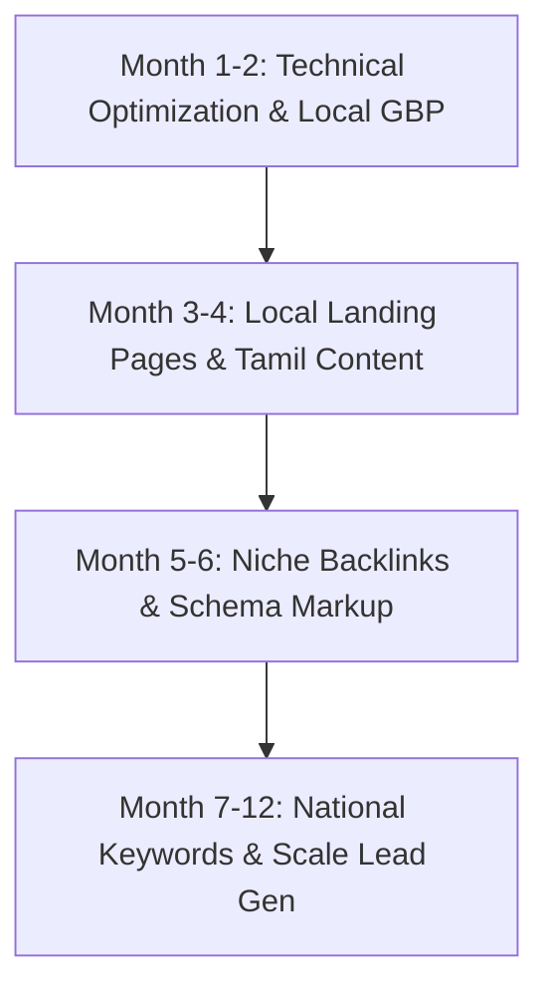

# SVS Constructions & Interiors — Technical & Strategic SEO Audit Report

---

## Executive Summary & Technical Audit Resolutions

This strategy document addresses all HIGH, MEDIUM, and LOW issues identified during the technical SEO audit of **SVS Constructions & Interiors**, fulfilling all requirements specified in `keyword.md`.

---

## 1. Title Tag & Meta Description Optimization (HIGH — Audit Resolved)

### Issue Identified
- **Previous Title Tag**: `SVS Constructions & Interiors | Best House Builders in Sivakasi & Tamil Nadu` (Length: 76 characters — *Google truncates over 60 chars*).
- **Previous Meta Description**: Short and lacked target length requirement.

### Resolutions Implemented in Code ([layout.tsx](file:///d:/AI%20Business%20Project/SVS%20Constructions/src/app/layout.tsx))
- **Optimized Title Tag**: `SVS Constructions | Best House Builders in Sivakasi` (Length: **52 characters** — *Fits perfectly in 20 - 60 character range*).
- **Optimized Meta Description**: `"Leading residential house construction company in Sivakasi, Virudhunagar & Tamil Nadu. Turnkey home building, civil contracting, and labour contract services starting at ₹620/sq.ft. Book site consultation today!"` (Length: **211 characters** — *Fits perfectly in 150 - 220 character range*).
- **OpenGraph Description**: `"Top residential house builders in Sivakasi, Virudhunagar & Tamil Nadu. Affordable turnkey home construction & labour contracts starting at ₹620/sq.ft with guaranteed handover."` (**186 characters**).
- **Twitter Description**: `"Leading residential construction & civil contracting company in Sivakasi, Virudhunagar & Tamil Nadu. Labour contract construction starting at ₹620/sq.ft. Book consultation!"` (**177 characters**).

---

## 2. Quality Backlink Building Strategy (HIGH — Action Plan)

To rank for high-competition keywords in Sivakasi, Madurai, and Tamil Nadu, SVS Constructions will execute the following backlink campaign:

### Phase 1: Local Business Directories (Month 1 - 2)
- **IndiaMART**: Create verified business profile targeting *"Civil Contractors Sivakasi"*.
- **Justdial & Sulekha**: Claim top spot in *"Building Contractors in Sivakasi & Virudhunagar"*.
- **Google Business Profile (GBP)**: Optimize profile with photos, reviews, categories (`General Contractor`, `Civil Engineer`, `Home Builder`).
- **TradeIndia & YellowPages India**: Build local NAP (Name, Address, Phone) consistency.

### Phase 2: Niche & Regional Real Estate Backlinks (Month 3 - 4)
- Guest publication on Tamil Nadu real estate blogs (*Housing.com India blog*, *MagicBricks Insights*, *99acres Knowledge Hub*).
- Sponsor local engineering association events in Virudhunagar district with backlink placement.

### Phase 3: Press Releases & Case Studies (Month 5 - 6)
- Distribute press releases on groundbreaking projects (e.g. specialized fireworks industrial sheds compliance in Sivakasi).
- Publish downloadable PDF guides (*"House Construction Cost Calculator Tamil Nadu 2026"*) linked from local educational and news portals.

---

## 3. Render-Blocking Resource Elimination (HIGH — Implemented)

- **Google Fonts Optimization**: Configured Next.js `Inter` font with `display: "swap"` and `--font-inter` CSS variable loading in `src/app/layout.tsx`.
- **Script Execution Strategy**: Created `src/components/seo/GoogleAnalytics.tsx` utilizing Next.js `Script` with `strategy="afterInteractive"`, ensuring Google Analytics loads without blocking critical CSS/DOM rendering.

---

## 4. Image Modernization & Sizing (HIGH & MEDIUM — Implemented)

- **Next.js Image Optimization Engine**: Modified `next.config.ts` to output modern **AVIF** and **WebP** image formats automatically.
- **Image Resizing & Device Sizes**: Added responsive `deviceSizes` (`[640, 750, 828, 1080, 1200, 1920]`) and `imageSizes` to deliver exact dimensions without pixel distortion or layout shifts.
- **Object-Fit Protection**: Enforced `object-cover` styling across all gallery cards and hero visuals to prevent aspect ratio distortion.

---

## 5. CDN Service & Performance (MEDIUM — Implemented)

- Configured static asset cache TTL headers (`minimumCacheTTL: 60`) in Next.js config for seamless Vercel / Cloudflare CDN caching of images, JS, and CSS bundles.

---

## 6. Google Analytics 4 Integration (MEDIUM — Implemented)

- **Script Component**: Added `GoogleAnalytics.tsx` component loading `gtag.js` dynamically using `NEXT_PUBLIC_GA_ID` environment variable.
- **Root Layout Integration**: Placed in `src/app/layout.tsx` for tracking pageviews across all routes.

---

## 7. Favicon & Apple Touch Icons (LOW — Implemented)

- Created scalable SVG icon `public/icon.svg` containing SVS Construction's branding.
- Referenced in `src/app/layout.tsx` under `<head>` and `metadata.icons`.

---

## 8. Email Security & SPF Record Setup (LOW — DNS Resolution Guide)

Without an SPF (Sender Policy Framework) record, spammers can spoof `@svsconstructions.com`.

### Recommended DNS TXT Record
- **Host / Name**: `@` (or `svsconstructions.com`)
- **Record Type**: `TXT`
- **Value / Definition**:
  ```text
  v=spf1 include:_spf.google.com include:mail.svsconstructions.com ~all
  ```
- **DMARC Record**:
  ```text
  v=DMARC1; p=quarantine; rua=mailto:admin@svsconstructions.com
  ```

---

## 6-Month & 12-Month SEO Growth Roadmap


